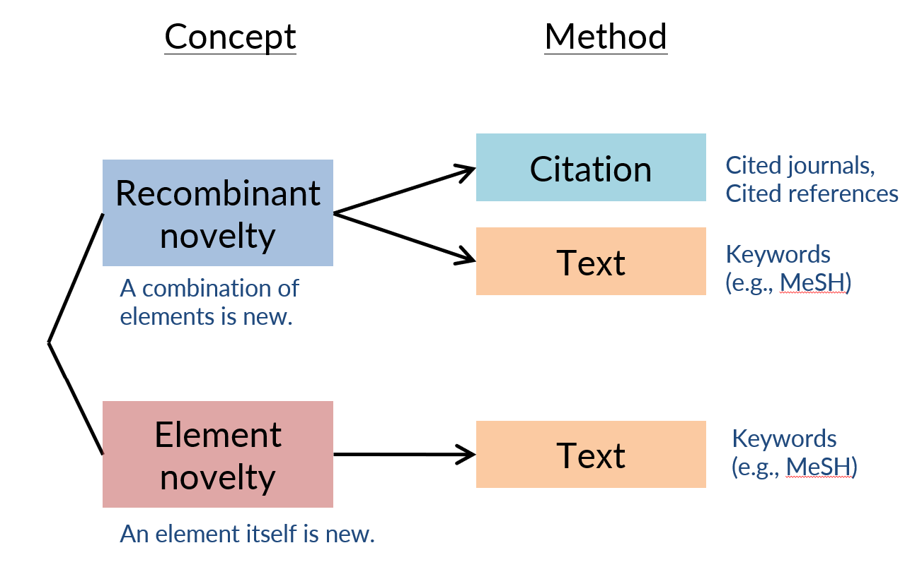

# Novelty_Element

Code for Measuring Novelty of all scientific publications in Web of Science Database with Word Embeddings 

## Basic info

- **Authors**: Deyun Yin,Zhao Wu,Kazuki Yokota,Kuniko Matsumoto,Sotaro Shibayama
- **Abstract**: As novelty is a core value in science, a reliable approach to measuring the novelty of scientific documents is critical. Previous novelty measures however had a few limitations. First, the majority of previous measures are based on recombinant novelty concept, attempting to identify a novel combination of knowledge elements, but insufficient effort has been made to identify a novel element itself (element novelty). Second, most previous measures are not validated, and it is unclear what aspect of newness is measured. Third, some of the previous measures can be computed only in certain scientific fields for technical constraints. This study thus aims to provide a validated and field-universal approach to computing element novelty. We drew on machine learning to develop a word embedding model, which allows us to extract semantic information from text data. Our validation analyses suggest that our word embedding model does convey semantic information. Based on the trained word embedding, we quantified the element novelty of a document by measuring its distance from the rest of the document universe. We then carried out a questionnaire survey to obtain self-reported novelty scores from 800 scientists. We found that our element novelty measure is significantly correlated with self-reported novelty in terms of discovering and identifying new phenomena, substances, molecules, etc. and that this correlation is observed across different scientific fields.
- **Keywords**: Novelty, Originality, Scientific Publications, Web of Science, Word Embeddings, Word2Vec
- **Citation**: Yin D, Wu Z, Yokota K, Matsumoto K, Shibayama S (2023) [Identify novel elements of knowledge with word embedding](https://journals.plos.org/plosone/article?id=10.1371/journal.pone.0284567). PLoS ONE 18(6): e0284567. https://doi.org/10.1371/journal.pone.0284567

## Expplanation of algorithms

